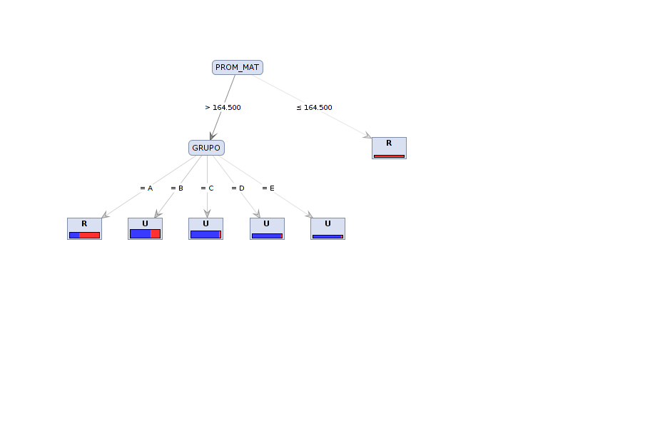

#Resultado 2
##La promedio en Matematicas por establecimiento en el area Rural y Urbana

El análisis que se propone para este ejemplo, es llegar a construir un modelo que permita predecir cuál será el nivel de aprendizaje logrado en matemáticas por establecimiento, dependiendo si pertenecen al area Rural y a la Urbana

##Conclusiones
Para el caso de este ejemplo, se observa que los estudiantes del area urbana tienen mucha mejor preparacion que los estudiantes del area rural
