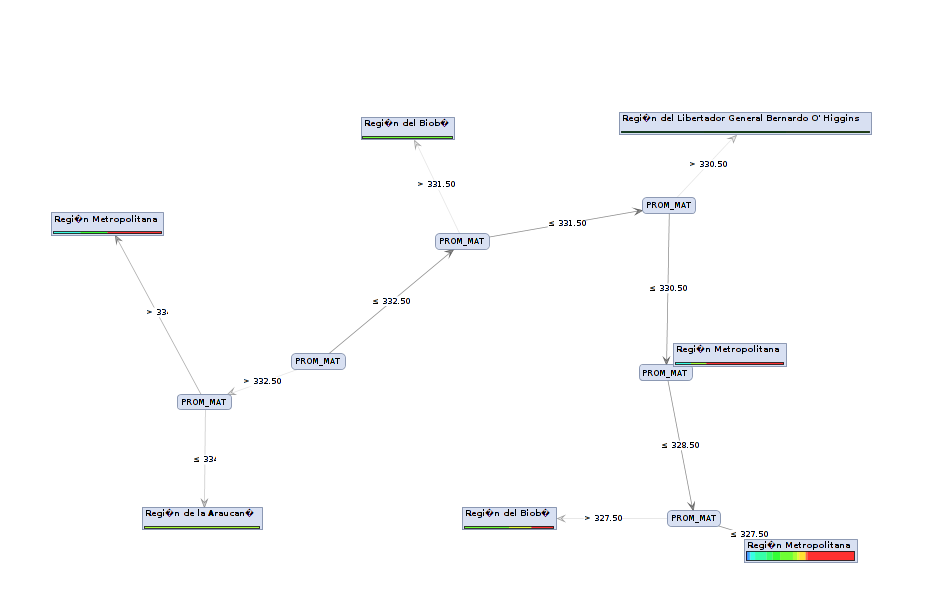

#Resultado 3

##Establecimientos clasificados como avanzados segun la SIMCE

El análisis que se propone para este ejemplo, es llegar a construir un modelo que permita mostrar cual es la cantidad de establecimientos con una clasificacion de avanzado por parte de la SIMCE con unpromedio en amtematicas superior a 250.

##Conclusiones
Podemos que la Region metropolitana es la que contiene la mayor cantidad de establecimientos con nivel Avanzado en la SIMCE
